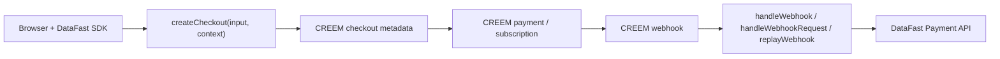

# `@itzsudhan/creem-datafast`

Generic-first revenue attribution for CREEM + DataFast.

This repo contains the publish-ready package, a public Next.js demo, an Express example, framework recipes, and supporting docs for taking DataFast visitor attribution from the browser all the way through CREEM checkout metadata and back into DataFast payment events.


## Links

- Demo: [creem-datafast.itzsudhan.com](https://creem-datafast.itzsudhan.com)
- Package README: [packages/creem-datafast/README.md](./packages/creem-datafast/README.md)
- Step-by-step guide: [guide.md](./guide.md)
- Docs index: [docs/README.md](./docs/README.md)
- Framework cookbook: [docs/frameworks/README.md](./docs/frameworks/README.md)
- Testing and quality: [docs/testing-and-quality.md](./docs/testing-and-quality.md)
- Troubleshooting: [docs/troubleshooting.md](./docs/troubleshooting.md)
- Hosted AI skill: [creem-datafast.itzsudhan.com/SKILL.md](https://creem-datafast.itzsudhan.com/SKILL.md)

## Start Here

| If you want to... | Open this |
| --- | --- |
| install and wire the package quickly | [guide.md](./guide.md) |
| understand the full repo and demo surface | [README.md](./README.md) |
| read the npm-facing API docs | [packages/creem-datafast/README.md](./packages/creem-datafast/README.md) |
| copy a framework-specific integration | [docs/frameworks/README.md](./docs/frameworks/README.md) |
| use the optional React layer | [docs/react.md](./docs/react.md) |
| debug a broken integration | [docs/troubleshooting.md](./docs/troubleshooting.md) |

## What You Get

- Official `creem` core SDK wrapper, not `creem_io`
- Automatic `datafast_visitor_id` and `datafast_session_id` resolution
- Metadata injection during `createCheckout()`
- Generic webhook handling for any framework
- Tiny helper exports for Next.js and Express
- Browser helpers for API routes and hosted CREEM payment links
- Optional React layer under `@itzsudhan/creem-datafast/react`
- `healthCheck()` for deploy and readiness checks
- `replayWebhook()` for signed webhook reprocessing
- Signed `smoke-webhook` CLI with a built-in fixture
- Idempotency, Upstash adapter, retry logic, currency-aware conversion, and transaction hydration
- `92` passing tests with `100%` statements, branches, functions, and lines

## Why Teams Use It

Most CREEM + DataFast integrations break down into the same three problems:

- getting the browser visitor ID into checkout creation reliably
- preserving that tracking through hosted CREEM flows
- verifying and replaying webhooks safely without hand-written glue code

This package owns those pieces end to end so the merchant integration stays small.

## Integration Modes

| Mode | When to use it | Main entrypoint |
| --- | --- | --- |
| server checkout wrapper | your backend creates CREEM checkouts | `createCheckout(input, context?)` |
| generic webhook handler | any framework with raw body or `Request` access | `handleWebhook(...)` or `handleWebhookRequest(...)` |
| framework helper | you want a tiny adapter for common setups | `/next` or `/express` |
| browser helpers | browser calls your checkout route or opens hosted links | `@itzsudhan/creem-datafast/client` |
| React attribution layer | you want provider, hooks, and styled widgets | `@itzsudhan/creem-datafast/react` |
| ops and support | readiness checks, replay, smoke tests | `healthCheck()`, `replayWebhook()`, CLI |

## Repo Layout

- `packages/creem-datafast`: the package source
- `apps/demo-next`: the public demo app
- `apps/example-express`: the Express example app
- `docs`: framework guides, testing notes, troubleshooting, and supporting docs
- `guide.md`: the fastest path from install to verified attribution

## Architecture



## Install

```bash
pnpm add @itzsudhan/creem-datafast
```

If you want the fastest integration path, go straight to [guide.md](./guide.md).

## Supported Frameworks

Documented and supported integration paths:

- Next.js
- Express
- Bun
- Hono
- Fastify
- Elysia
- Nitro
- NestJS
- generic Fetch-style runtimes
- generic raw-body runtimes

Recipes live in [docs/frameworks/README.md](./docs/frameworks/README.md).

## Core API

Create one shared server client:

```ts
import { createCreemDataFast } from "@itzsudhan/creem-datafast";

export const creemDataFast = createCreemDataFast({
  creemApiKey: process.env.CREEM_API_KEY!,
  creemWebhookSecret: process.env.CREEM_WEBHOOK_SECRET!,
  datafastApiKey: process.env.DATAFAST_API_KEY!,
  testMode: true,
});
```

Primary methods:

| Method | Purpose |
| --- | --- |
| `createCheckout(input, context?)` | resolves tracking and injects metadata before calling CREEM |
| `handleWebhook({ rawBody, headers })` | verifies, maps, deduplicates, and forwards a webhook |
| `handleWebhookRequest(request)` | same as above for Fetch-style runtimes |
| `replayWebhook({ rawBody, headers })` | reprocesses a signed webhook without idempotency claim checks |
| `verifyWebhookSignature(rawBody, headers)` | verifies the `creem-signature` header |
| `forwardPayment(payment)` | manually forwards a normalized DataFast payment |
| `healthCheck()` | reports config and DataFast reachability status |

## 60-Second Setup

```ts
import { createCreemDataFast } from "@itzsudhan/creem-datafast";
import { createNextWebhookHandler } from "@itzsudhan/creem-datafast/next";

export const creemDataFast = createCreemDataFast({
  creemApiKey: process.env.CREEM_API_KEY!,
  creemWebhookSecret: process.env.CREEM_WEBHOOK_SECRET!,
  datafastApiKey: process.env.DATAFAST_API_KEY!,
  testMode: true,
});

export const POST = createNextWebhookHandler(creemDataFast);
```

Then route all checkout creation through `createCheckout(...)` so DataFast tracking is injected into CREEM metadata automatically.

## Export Surface

Root export:

- `createCreemDataFast`
- `createExpressWebhookHandler`
- `createNextWebhookHandler`
- typed errors
- `MemoryIdempotencyStore`

Subpaths:

- `@itzsudhan/creem-datafast/react`
- `@itzsudhan/creem-datafast/next`
- `@itzsudhan/creem-datafast/express`
- `@itzsudhan/creem-datafast/client`
- `@itzsudhan/creem-datafast/idempotency/upstash`

## Tracking Resolution

`createCheckout()` resolves tracking in this order:

1. explicit `tracking`
2. existing `metadata.datafast_*`
3. query params `datafast_*`
4. query params `_df_vid` / `_df_sid`
5. cookies `datafast_visitor_id` / `datafast_session_id`

That resolved tracking is then merged into CREEM checkout metadata without dropping merchant metadata.

## Quickstart

### Next.js

```ts
import { createNextWebhookHandler } from "@itzsudhan/creem-datafast/next";
import { creemDataFast } from "@/lib/creem-datafast";

export const runtime = "nodejs";
export const POST = createNextWebhookHandler(creemDataFast);
```

### Express

```ts
import express from "express";
import { createCreemDataFast } from "@itzsudhan/creem-datafast";
import { createExpressWebhookHandler } from "@itzsudhan/creem-datafast/express";

const app = express();
const client = createCreemDataFast({ ...env });

app.post(
  "/webhooks/creem",
  express.raw({ type: "application/json" }),
  createExpressWebhookHandler(client),
);
```

### Generic Fetch runtimes

```ts
const result = await creemDataFast.handleWebhookRequest(request);
return new Response(result.ignored ? "Ignored" : "OK", { status: 200 });
```

### Generic raw-body runtimes

```ts
const result = await creemDataFast.handleWebhook({
  rawBody,
  headers,
});
```

For the full step-by-step version, including checkout creation and verification, use [guide.md](./guide.md).

## Browser And Hosted-Link Helpers

Browser helpers live under `@itzsudhan/creem-datafast/client`.

```ts
import {
  appendDataFastTracking,
  attributeCreemPaymentLink,
  getDataFastTracking,
} from "@itzsudhan/creem-datafast/client";

const tracking = getDataFastTracking();
const checkoutApiUrl = appendDataFastTracking("/api/checkout", tracking);
const directPaymentLink = attributeCreemPaymentLink("https://creem.io/payment/prod_123", tracking);
```

Use them when:

- the browser needs to hit your checkout API route with live DataFast IDs
- you want to preserve attribution across domains
- you are using a direct hosted CREEM payment link instead of a server-created checkout

## React Layer

The optional React layer lives under `@itzsudhan/creem-datafast/react`.

```tsx
"use client";

import {
  CreemCheckoutButton,
  CreemDataFastProvider,
  CreemPaymentLinkButton,
  TrackingInspector,
} from "@itzsudhan/creem-datafast/react";

export function AttributionSurface() {
  return (
    <CreemDataFastProvider apiUrl="/api/events" websiteId={process.env.NEXT_PUBLIC_DATAFAST_WEBSITE_ID!}>
      <TrackingInspector />
      <CreemCheckoutButton action="/api/checkout">Launch Server Checkout</CreemCheckoutButton>
      <CreemPaymentLinkButton href="https://creem.io/payment/prod_123">
        Open Direct Creem Link
      </CreemPaymentLinkButton>
    </CreemDataFastProvider>
  );
}
```

It owns:

- DataFast SDK init
- initial pageview flush before checkout launch
- visitor/session tracking state
- attributed checkout action URLs
- attributed hosted CREEM links
- neobrutalist widgets for React and Next.js

More detail: [docs/react.md](./docs/react.md)

## Ops Helpers

Readiness and replay:

```ts
const health = await creemDataFast.healthCheck();
const replayed = await creemDataFast.replayWebhook({ rawBody, headers });
```

Signed local smoke replay:

```bash
pnpm smoke:webhook --url http://localhost:3000/webhooks/creem --secret whsec_xxx
```

Published package CLI:

```bash
npx @itzsudhan/creem-datafast smoke-webhook --url http://localhost:3000/webhooks/creem --secret whsec_xxx
```

The package includes a built-in fixture so you can smoke-test a webhook route without building a payload by hand.

## DataFast Payment Mapping

The package maps CREEM webhook data into the DataFast Payments API shape:

| Field | Source |
| --- | --- |
| `amount` | CREEM minor units converted by currency exponent |
| `currency` | CREEM transaction currency |
| `transaction_id` | CREEM transaction ID |
| `datafast_visitor_id` | CREEM metadata or resolved checkout tracking |
| `email` | CREEM customer email when available |
| `name` | CREEM customer name when available |
| `customer_id` | CREEM customer ID when available |
| `renewal` | derived from recurring payment shape |
| `refunded` | set for `refund.created` |
| `timestamp` | transaction or webhook timestamp |

## Production Features

- refund forwarding via `refund.created`
- subscription deduping so initial subscription checkouts do not double-count renewals
- optional transaction hydration for more accurate recurring amounts
- idempotency via in-memory storage by default
- Upstash Redis adapter for production
- retry with exponential backoff and jitter
- typed errors with retry metadata
- same-origin DataFast proxy support shown in the demo app

## Environment Variables

Core package runtime:

- `CREEM_API_KEY`
- `CREEM_WEBHOOK_SECRET`
- `DATAFAST_API_KEY`

Demo app:

- `APP_BASE_URL`
- `CREEM_PRODUCT_ID`
- `NEXT_PUBLIC_DATAFAST_WEBSITE_ID`
- `NEXT_PUBLIC_DATAFAST_DOMAIN` optional override

## Demo And Examples

### Public demo

The Next.js demo includes:

- CREEM-branded neobrutalist landing page
- official DataFast SDK init
- root-domain visitor/session capture
- same-origin `/api/events` proxy
- server checkout flow
- direct hosted CREEM link flow
- visible forwarded payload feed

### Local demo

```bash
cp apps/demo-next/.env.example apps/demo-next/.env.local
pnpm install
pnpm --filter demo-next dev
```

### Local Express example

```bash
cp apps/example-express/.env.example apps/example-express/.env
pnpm install
pnpm --filter example-express dev
```

## Compare The Surfaces

| Surface | Ships in package | Use it for |
| --- | --- | --- |
| root API | yes | shared server client, checkout creation, webhook handling |
| `/next` | yes | one-line Next.js route handler |
| `/express` | yes | Express raw-body middleware helper |
| `/client` | yes | browser attribution helpers |
| `/react` | yes | provider, hooks, and neobrutalist widgets |
| demo app | repo | live end-to-end attribution walkthrough |
| framework cookbook | repo | Bun, Hono, Fastify, Elysia, Nitro, NestJS recipes |

## AI Agent Support

Hosted prompt:

```text
Read https://creem-datafast.itzsudhan.com/SKILL.md and integrate @itzsudhan/creem-datafast into this app.
```

Local skill install:

```bash
npx @itzsudhan/creem-datafast skill --write ./SKILL.md
```

## Quality

- `92` passing tests
- `100%` statements
- `100%` branches
- `100%` functions
- `100%` lines
- CI on `push`, `pull_request`, and manual dispatch
- validation on Node `20`
- test matrix on Node `18`, `20`, `22`
- Bun smoke coverage

More detail: [docs/testing-and-quality.md](./docs/testing-and-quality.md)

## Local Commands

```bash
pnpm install
pnpm test
pnpm coverage
pnpm typecheck
pnpm build
pnpm smoke:webhook --url http://localhost:3000/webhooks/creem --secret whsec_xxx
```

## Documentation Map

- Start here: [README.md](./README.md)
- Guided setup: [guide.md](./guide.md)
- Docs index: [docs/README.md](./docs/README.md)
- Package README: [packages/creem-datafast/README.md](./packages/creem-datafast/README.md)
- React guide: [docs/react.md](./docs/react.md)
- Framework cookbook: [docs/frameworks/README.md](./docs/frameworks/README.md)
- Testing and quality: [docs/testing-and-quality.md](./docs/testing-and-quality.md)
- Troubleshooting: [docs/troubleshooting.md](./docs/troubleshooting.md)

## License

MIT
