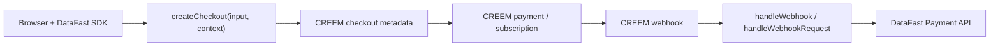

# `@itzsudhan/creem-datafast`

Generic-first revenue attribution for CREEM + DataFast.

This monorepo contains the package, the public demo, the Express example, the framework cookbook, and the hosted AI-agent skill file for integrating CREEM revenue attribution without merchant-side glue code.

## Links

- Demo: [creem-datafast.itzsudhan.com](https://creem-datafast.itzsudhan.com)
- Repo: [github.com/SudhanPlayz/creem-datafast](https://github.com/SudhanPlayz/creem-datafast)
- Hosted skill: [creem-datafast.itzsudhan.com/SKILL.md](https://creem-datafast.itzsudhan.com/SKILL.md)
- Framework cookbook: [docs/frameworks/README.md](./docs/frameworks/README.md)
- Requirements checklist: [docs/requirements-checklist.md](./docs/requirements-checklist.md)
- Testing and quality: [docs/testing-and-quality.md](./docs/testing-and-quality.md)
- Troubleshooting: [docs/troubleshooting.md](./docs/troubleshooting.md)

## Why This Submission Stands Out

- Wraps the official [`creem`](https://docs.creem.io/code/sdks/typescript-core) core SDK directly, not `creem_io`
- Generic-first API for any framework, with only one tiny Next.js helper export
- Public demo that visibly shows checkout creation, webhook processing, and the exact DataFast payload
- Root-domain DataFast tracking plus same-origin event proxy support for subdomain-safe attribution
- Hosted `SKILL.md` and local `npx` installer for AI-agent onboarding
- Refund support, idempotency, currency-aware amounts, retry logic, and transaction hydration
- `67` passing tests with `100%` statements, branches, functions, and lines
- CI on push and PR with Node `18`, `20`, `22`, plus Bun smoke coverage

## What The Package Does

- Creates CREEM checkouts through one wrapper around the official core SDK
- Resolves `datafast_visitor_id` and `datafast_session_id` from explicit input, metadata, query params, and cookies
- Injects tracking metadata into CREEM checkout creation without dropping merchant metadata
- Verifies raw CREEM webhook signatures before parsing payloads
- Maps `checkout.completed`, `subscription.paid`, and `refund.created` into DataFast payment payloads
- Deduplicates webhook events and avoids double-attribution for subscription checkouts
- Retries transient DataFast API failures with exponential backoff and jitter
- Supports direct hosted CREEM payment links through browser helpers

## Requirements Coverage

Every listed challenge requirement is implemented and documented in [docs/requirements-checklist.md](./docs/requirements-checklist.md).

Highlights:

- `createCheckout()` auto-injects DataFast visitor/session tracking
- `handleWebhook()` supports `checkout.completed` and `subscription.paid`
- `handleWebhookRequest(request)` covers Fetch-style runtimes
- `createNextWebhookHandler()` satisfies the framework adapter requirement
- `appendDataFastTracking()` and `attributeCreemPaymentLink()` cover browser-side and direct-link flows

## Architecture



## Monorepo Layout

- `packages/creem-datafast`: publish-ready TypeScript package
- `apps/demo-next`: flagship public Next.js demo
- `apps/example-express`: minimal Express example using the generic raw-body API
- `docs/frameworks`: Bun, Hono, Fastify, Elysia, Nitro, NestJS, and integration guidance

## Install

```bash
pnpm add @itzsudhan/creem-datafast
```

## Quickstart

### 1. Create The Shared Client

```ts
import { createCreemDataFast } from "@itzsudhan/creem-datafast";

export const creemDataFast = createCreemDataFast({
  creemApiKey: process.env.CREEM_API_KEY!,
  creemWebhookSecret: process.env.CREEM_WEBHOOK_SECRET!,
  datafastApiKey: process.env.DATAFAST_API_KEY!,
  testMode: true,
});
```

### 2. Create Checkouts Through The Wrapper

```ts
const checkout = await creemDataFast.createCheckout(
  {
    productId: process.env.CREEM_PRODUCT_ID!,
    successUrl: `${process.env.APP_BASE_URL!}/success`,
  },
  { request },
);
```

### 3. Wire The CREEM Webhook

Fetch-style runtimes:

```ts
const result = await creemDataFast.handleWebhookRequest(request);
return new Response(result.ignored ? "Ignored" : "OK", { status: 200 });
```

Raw-body runtimes:

```ts
const result = await creemDataFast.handleWebhook({
  rawBody,
  headers,
});
```

## Next.js Quickstart

```ts
// lib/creem-datafast.ts
import { createCreemDataFast } from "@itzsudhan/creem-datafast";

export const creemDataFast = createCreemDataFast({
  creemApiKey: process.env.CREEM_API_KEY!,
  creemWebhookSecret: process.env.CREEM_WEBHOOK_SECRET!,
  datafastApiKey: process.env.DATAFAST_API_KEY!,
  testMode: true,
});
```

```ts
// app/api/checkout/route.ts
import { creemDataFast } from "@/lib/creem-datafast";

export const runtime = "nodejs";

export async function POST(request: Request) {
  const checkout = await creemDataFast.createCheckout(
    {
      productId: process.env.CREEM_PRODUCT_ID!,
      successUrl: `${process.env.APP_BASE_URL!}/success`,
    },
    { request },
  );

  return Response.redirect(checkout.checkoutUrl!, 303);
}
```

```ts
// app/api/webhooks/creem/route.ts
import { createNextWebhookHandler } from "@itzsudhan/creem-datafast/next";
import { creemDataFast } from "@/lib/creem-datafast";

export const runtime = "nodejs";
export const POST = createNextWebhookHandler(creemDataFast);
```

## Express Quickstart

```ts
import express from "express";
import { createCreemDataFast } from "@itzsudhan/creem-datafast";

const app = express();
const creemDataFast = createCreemDataFast({
  creemApiKey: process.env.CREEM_API_KEY!,
  creemWebhookSecret: process.env.CREEM_WEBHOOK_SECRET!,
  datafastApiKey: process.env.DATAFAST_API_KEY!,
  testMode: true,
});

app.post("/checkout", async (req, res) => {
  const checkout = await creemDataFast.createCheckout(
    {
      productId: process.env.CREEM_PRODUCT_ID!,
      successUrl: `${process.env.APP_BASE_URL!}/success`,
    },
    {
      request: {
        headers: req.headers,
        url: `${process.env.APP_BASE_URL!}${req.originalUrl}`,
      },
    },
  );

  res.redirect(303, checkout.checkoutUrl!);
});

app.post("/webhooks/creem", express.raw({ type: "application/json" }), async (req, res) => {
  const result = await creemDataFast.handleWebhook({
    rawBody: req.body.toString("utf8"),
    headers: req.headers,
  });

  res.status(200).send(result.ignored ? "Ignored" : "OK");
});
```

## Browser Helper And Direct-Link Flow

```ts
import { initDataFast } from "datafast";
import {
  appendDataFastTracking,
  attributeCreemPaymentLink,
  getDataFastTracking,
} from "@itzsudhan/creem-datafast/client";

const datafast = await initDataFast({
  websiteId: process.env.NEXT_PUBLIC_DATAFAST_WEBSITE_ID!,
});

await datafast.trackPageview();
await datafast.flush();

const tracking = getDataFastTracking() ?? {
  datafastVisitorId: datafast.getTrackingParams()._df_vid,
  datafastSessionId: datafast.getTrackingParams()._df_sid,
};

const checkoutApiUrl = appendDataFastTracking("/api/checkout", tracking);
const directCreemLink = attributeCreemPaymentLink(
  "https://creem.io/payment/prod_123",
  tracking,
);
```

## Supported Frameworks

Use one of two primitives:

- `handleWebhookRequest(request)` for Bun, Hono, Elysia, Nitro, Workers, and Fetch-style runtimes
- `handleWebhook({ rawBody, headers })` for Express, Fastify, NestJS, and other Node servers with raw-body access

Detailed recipes live in [docs/frameworks/README.md](./docs/frameworks/README.md).

## Payload Mapping

The webhook mapper forwards the following DataFast payment shape:

| Field | Source |
| --- | --- |
| `amount` | CREEM minor units converted by currency exponent |
| `currency` | CREEM transaction currency |
| `transaction_id` | CREEM transaction ID |
| `datafast_visitor_id` | CREEM metadata or resolved checkout tracking |
| `email` | CREEM customer email when available |
| `name` | CREEM customer name when available |
| `customer_id` | CREEM customer ID when available |
| `renewal` | Derived from subscription payment type |
| `refunded` | `true` for `refund.created` |
| `timestamp` | Transaction or webhook timestamp |

## Production Features

- Refund forwarding via `refund.created`
- Subscription deduping so initial subscription checkouts do not double-count against renewals
- Transaction hydration for more accurate recurring payment amounts
- Idempotency via in-memory store by default or Upstash Redis in production
- Retry with exponential backoff and jitter for transient DataFast failures
- Typed errors including retryable request failures

## Demo Apps

### Next.js Demo

```bash
cp apps/demo-next/.env.example apps/demo-next/.env.local
pnpm install
pnpm --filter demo-next dev
```

The public demo includes:

- landing page with CREEM-branded neobrutalist UI
- official DataFast SDK initialization
- root-domain visitor/session capture
- same-origin `/api/events` proxy for browser analytics
- server checkout flow
- direct hosted CREEM payment-link flow
- webhook route powered by the package
- visible forwarded-payload feed for judges

### Express Example

```bash
cp apps/example-express/.env.example apps/example-express/.env
pnpm install
pnpm --filter example-express dev
```

## Environment Variables

### Package Runtime

- `CREEM_API_KEY`
- `CREEM_WEBHOOK_SECRET`
- `DATAFAST_API_KEY`

### Demo App

- `APP_BASE_URL`
- `CREEM_PRODUCT_ID`
- `NEXT_PUBLIC_DATAFAST_WEBSITE_ID`
- `NEXT_PUBLIC_DATAFAST_DOMAIN` optional override for tricky subdomain setups

See [docs/troubleshooting.md](./docs/troubleshooting.md) for `First event not found` and raw-body issues.

## AI Agent Support

Hosted prompt:

```text
Read https://creem-datafast.itzsudhan.com/SKILL.md and integrate @itzsudhan/creem-datafast into this app.
```

Local skill install:

```bash
npx @itzsudhan/creem-datafast skill --write ./SKILL.md
```

## Testing And CI

Current quality bar:

- `67` passing tests
- `100%` statements
- `100%` branches
- `100%` functions
- `100%` lines
- CI on `push`, `pull_request`, and manual dispatch
- Validation on Node `20`
- Test matrix on Node `18`, `20`, `22`
- Bun smoke coverage

More detail: [docs/testing-and-quality.md](./docs/testing-and-quality.md)

## Local Commands

```bash
pnpm install
pnpm test
pnpm coverage
pnpm typecheck
pnpm build
```

## Docs Index

- [docs/requirements-checklist.md](./docs/requirements-checklist.md)
- [docs/frameworks/README.md](./docs/frameworks/README.md)
- [docs/testing-and-quality.md](./docs/testing-and-quality.md)
- [docs/troubleshooting.md](./docs/troubleshooting.md)

## License

MIT
